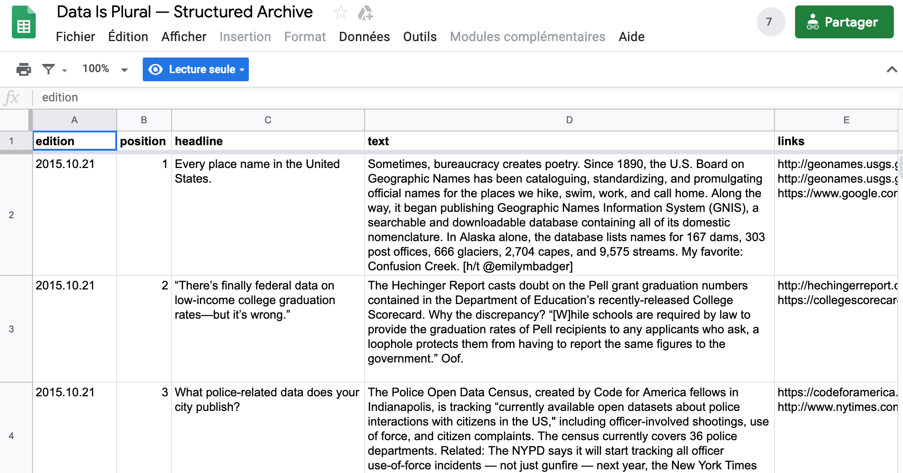
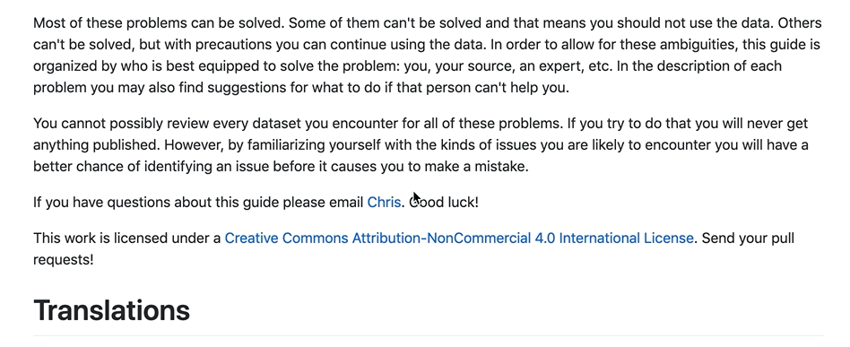
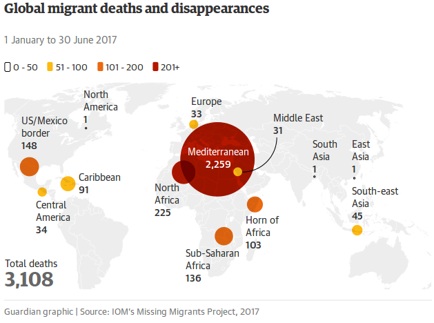
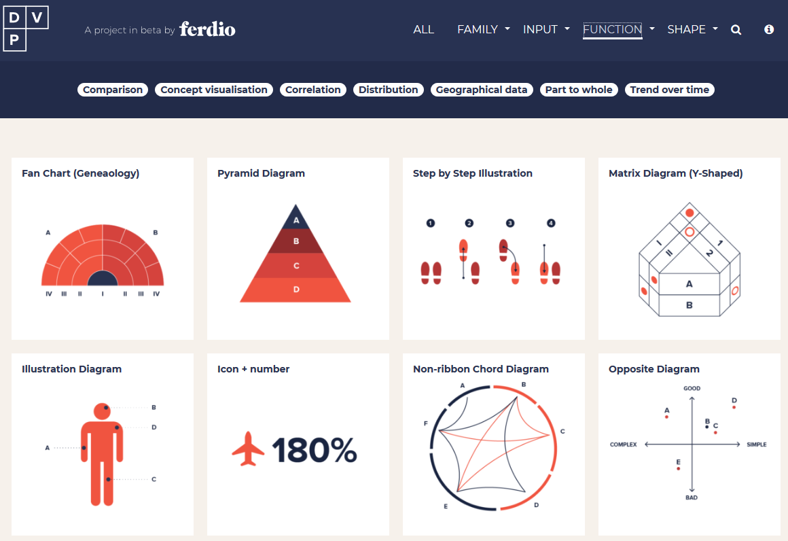

layout: true
  

`r paste0("
", params$event, " 

")` 

---

class: center, middle

Ces slides en ligne : `r paste0("http://datactivist.coop/", params$slug)`

Sources : `r paste0("https://github.com/datactivist/", params$slug)`

Les productions de Datactivist sont librement réutilisables selon les termes de la licence [Creative Commons 4.0 BY-SA](https://creativecommons.org/licenses/by-sa/4.0/legalcode.fr).

 
 

.reduite[]

---
### .red[Objectifs] de la journée

* **Partagez vos expériences** en tant que référent data

* Faire **remonter les besoins** d'appui et de sensibilisation

* Renforcer la **culture des données** du réseau des référents

* Préciser le **cadre juridique des données personnelles**

---
### .red[Le programme] de la journée

9h15 : accueil

9h30 :
* présentation de la journée,
* rappel sur les résultats de data position et des éléments de culture de données
* premières étapes de la méthodologie du _data pipeline_

11h30 : tour de table des besoins du groupe des référents data

12h30 : repas

14h : rappel des principes d'application du RGPD

16h : écueils à éviter dans l’interprétation et la visualisation des données

17h : fin

---
### .red[Rappel] : les 4 champs d'activité de la culture des données

.reduite[]

.footnote[Source : [Datactive](https://docs.google.com/presentation/d/1bK0kgQEf0sFfSHjUcv3gNLsbKsGCU6Ylb_z7IFM-DIw/edit#slide=id.g1bb6c8eb9a_1_27)]

---
### Des compétences d'.red[interprétation des données] à renforcer

.reduite.center[]

---
### Des compétences d'.red[interprétation des données] à renforcer

.reduite.center[]

---
class:inverse,middle,center

## Introduction au data pipeline
---

class:inverse,middle,center

## Introduction au data pipeline
---

###  Présentation du .red[data pipeline]

.pull-left[
.reduite[]
]

.pull-right[
Nous allons suivre la méthodologie du [Data Pipeline](http://schoolofdata.org/methodology) développée par School of Data 

* Une méthodologie générique pour la découverte et l'usage de données ouvertes

* 7 étapes qui, selon les projets, prennent une importance plus ou moins grande. 
]

---

### Définir

.pull-left[
.reduite[]
]
.pull-right[

#### Définir précisément votre problème

#### Que cherchez vous à comprendre ?

#### Quelles données vous seraient utiles ?

]

---

### Définir, c'est trouver un angle à votre sujet

.footnote[]

---

### Trouver

.pull-left[
.reduite[]
]
.pull-right[

#### Utiliser les opérateurs spéciaux

#### Chercher sur les portails open data

#### Utiliser les facettes pour trouver les bonnes données

#### Extraire des données d'OpenStreetMap

#### S'appuyer sur des ressources de [curation de données](https://teamopendata.org/t/curation-de-donnees-data-is-plural/734)
]

---
### Utiliser les .red[opérateurs spéciaux]

Exemple avec la requête "site:education.gouv.fr filetype:xlsx" :

---
### Utiliser les .red[facettes] pour trouver les bonnes données

.pull-left[

]

.pull-right[
Les facettes sont des filtres dans les métadonnées. 

Elles permettent de sélectionner par exemple uniquement un certain producteur. 

Cela peut faire gagner beaucoup de temps dans une recherche de données.
]
---
### Utiliser les .red[facettes] pour trouver les bonnes données

.pull-left[
Sans filtre par facette, à la requête écoles, on a des résultats étonnants en première page comme ces données de la FEMIS.  
]

.pull-right[
En gardant uniquement "Education Nationale"" dans la facette organisation, on s'assure de trouver des données nationales. 
]
---
### Utiliser Google Dataset Search

Google propose depuis quelques temps ce [moteur de recherche](https://toolbox.google.com/datasetsearch) aggrégant de très nombreux portails open data. Les résultats sont inégaux mais le moteur est encore nouveau…

---
### Chercher dans le [réseau de données OpenDataSoft](data.opendatasoft.com)
OpenDataSoft référence tous les jeux de données publiés sur l'ensemble de ses portails. Parmi eux, le portail Public référence des jeux de données introuvables ailleurs comme la [localisation des radars](https://data.opendatasoft.com/explore/dataset/radars%40public/table/). 

---
### Trouver le bon tag sur OSM
La page "[Elements Cartographiques](https://wiki.openstreetmap.org/wiki/FR:%C3%89l%C3%A9ments_cartographiques)" sur le wiki d'OSM recense tous les tags utilisés dans la base de données. 

.footnote[Plus d'infos : https://datactivist.coop/atelier-osm/]

---
### Utiliser des [ressources de curation de données](https://teamopendata.org/t/curation-de-donnees-data-is-plural/734)

Je recense sur [TeamOpenData](https://teamopendata.org/t/curation-de-donnees-data-is-plural/734) les meilleures ressources de curation de données. Une recherche vous aidera à trouver des données internationales que vous ne trouverez généralement pas autrement. 

Par exemple, l'excellente [newsletter Data Is Plural](https://tinyletter.com/data-is-plural/) propose chaque semaine une présentation des meilleurs jeux de données qui sont archivés dans une [feuille de calcul](https://docs.google.com/spreadsheets/d/1wZhPLMCHKJvwOkP4juclhjFgqIY8fQFMemwKL2c64vk/edit#gid=0).

---
### Récupérer 

.pull-left[
.reduite[]
]
.pull-right[

- #### Téléchargement direct

- #### API ou web service

- #### Scrapping de données

- #### Copier / coller

- #### Extraction (OpenStreetMap)

]

---
### .red[Scrapping] de données : quelques outils

[import.io](import.io) est un excellent outil qui facilite grandement l'extraction des données depuis un site web. L'outil détecte automatiquement la structure des données sur le site. 

.footnote[Loïc Haÿ a développé un [tutoriel](https://www.dropbox.com/s/yarrneyseghd7d6/05-%20Extraire%20des%20donn%C3%A9es%20%C3%A0%20partir%20de%20pages%20web.pdf?dl=0) pour utiliser import.io.]

---
### .red[Scrapping] de données : quelques outils

L'extension [Scraper](https://chrome.google.com/webstore/detail/scraper/mbigbapnjcgaffohmbkdlecaccepngjd?hl=fr) pour Chrome permet d'extraire en quelques clics les données d'un site. 

---
### .red[Scrapping] de données : quelques outils

L'excellente extension [WebScraper](https://www.webscraper.io/) est très puissante, elle permet d'extraire des données disséminée dans de multiples pages.

---
### .red[Extraire] des données d'OpenStreetMap

[Overpass-Turbo](overpass-turbo.eu) permet d'extraire des éléments spécifiques dans la base de données OpenStreetMap. Exemple ici avec les écoles dans l'Yonne : 

.footnote[Plus d'infos : https://datactivist.coop/atelier-osm/]
---

### Vérifier 

.pull-left[
.reduite[]
]

.pull-right[

- #### Bon sens

- #### Demander à la source

- #### S'appuyer sur des communautés d’experts

- #### Statistiques

]

---
### S'appuyer sur les .red[commentaires] dans data.gouv.fr

data.gouv.fr permet aux usagers de discuter autour des données, cela vous aidera à détecter les problèmes avec les données. 

---
### .red[WTFCsv] pour faire un contrôle rapide des données

[WTFCSV](https://www.databasic.io/en/wtfcsv/) est un outil de médiation de données qui propose un aperçu de vos fichiers CSV. 

---
### Nettoyer 

.pull-left[
.reduite[]
]
.pull-right[

- #### Toilettage

- #### Edition

- #### Consolidation

- #### Erreurs fréquentes

]

---
### Open Refine pour nettoyer les données

[OpenRefine](http://openrefine.org/) est un outil puissant pour explorer, transformer et rapprocher des données. 

<iframe width="560" height="315" src="https://www.youtube.com/embed/cO8NVCs_Ba0" frameborder="0" allow="accelerometer; autoplay; encrypted-media; gyroscope; picture-in-picture" allowfullscreen></iframe>

.footnote[Mathieu Saby a publié un [tutoriel complet](http://opendata.maregionsud.fr/fileadmin/user_upload/tx_ausynews/ODL/ODL_OpenRefine_Marseille_2017-06-09-v2.pdf). ]

---
### Le [sprint qualité](https://infolabs.io/sprint-qualite) pour détecter les problèmes dans les données

---
### Le [Quartz Bad Data Guide](https://infolabs.io/sprint-qualite) : un résumé des problèmes avec les données

---
### .red[Workbench] pour rendre reproductible les traitements

Workbench propose de nombreux outils de traitement et de visualisation des données rendant reproductible le nettoyage des données. Loïc Haÿ a produit avec un [Catalogue des Datasets des Départements](https://app.workbenchdata.com/workflows/14052/).
 
.reduite.center[

]

---

### Analyser 

.pull-left[
.reduite[]
]
.pull-right[

#### Type d’analyse
- Analyse statistique
- Analyse spatiale

#### Outils

- Tableur
- R
- QGIS (données géo)
- Etc.

]

---

### Présenter

.pull-left[
.reduite[]
]

.pull-right[

### Communiquer les résultats de votre analyse au public.
]

---
### .red[La data visualisation : pour quoi faire?]

 

> "La visualisation des données est un ensemble de méthodes de représentation graphique, en deux ou trois dimensions.
>
> *https://fr.wikipedia.org/wiki/Visualisation_de_donn%C3%A9es*

 

> "C'est une pratique consistant à mettre en image des données brutes, les rendant ainsi plus accessibles et compréhensibles. Elle donne du sens à ces données."
>
> .red[*Toucan Toco*]

---
### .red[Un exemple] de dataviz

#### Voici les données
Selon l'Organisation internationale des migrations, 3108 migrant·e·s ont trouvé la mort ou disparu durant le premier semestre 2017.

.pull-left[
- 2259 en Méditerranée
- 225 en Afrique du Nord ;
- 148 à la frontière américano-mexicaine ;
- 136 en Afrique subsaharienne ;
- 103 dans la Corne de l'Afrique ;
- 91 dans les Caraïbes ;
]

.pull-right[

- 45 en Asie du Sud-Est ;
- 34 en Amérique centrale ;
- 33 en Europe ;
- 31 au Moyen-Orient ;
- un·e en Amérique du Nord ;
- un·e en Asie du Sud ;
- un·e en Asie de l'Est.
]

---
### .red[Un exemple de dataviz]

#### Voici une dataviz réalisée à partir des données précédentes

.reduite.center[

]

.footnote[*Source* : [The Guardian, 11/09/2017](https://www.theguardian.com/world/2017/sep/11/migrant-death-toll-rises-after-clampdown-on-east-european-borders)]

---
### .red[Quel message] veut-on faire passer ?

- Une dataviz porte avant tout une **intention**, la volonté de transmettre une information.

--

- De cette intention découlera le **type de dataviz** à utiliser.

--
 

 

---

### .red[Panorama des ] fonctions de visualisation

**Connaissez-vous le "Data Viz Project" ?**
https://datavizproject.com/

.pull-left[
- Comparaison
- Visualisation de concept
- Corrélation
- Distribution
- Données géographiques
- Une partie d'un ensemble
- Changement de valeur dans le temps
]

.pull-right[
.center[.reduite[]]
]

---
###.red[Des outils]en fonction des usages
.center[.reduite[]]

---
### .red[RAWGraphs]
.center[.reduite[]]
#### .center[https://rawgraphs.io/]

---
### .red[Flourish]
.center[.reduite[]]
#### .center[https://app.flourish.studio/templates]

---
### .red[Datawrapper]
.center[.reduite[]]
#### .center[https://www.datawrapper.de/]

---
### .red[HighCharts]
.center[.reduite[]]
#### .center[https://www.highcharts.com/demo]

---
### .red[Tableau public]
.center[.reduite[]]
#### .center[https://public.tableau.com/fr-fr/s/]

---
### .red[Khartis]
.center[.reduite[]]
#### .center[http://www.sciencespo.fr/cartographie/khartis/]

---
### .red[macarte.ign]
.center[.reduite[]]
#### .center[https://macarte.ign.fr]
---

# Merci !

Contact : [samuel@datactivist.coop](mailto:samuel@datactivist.coop)